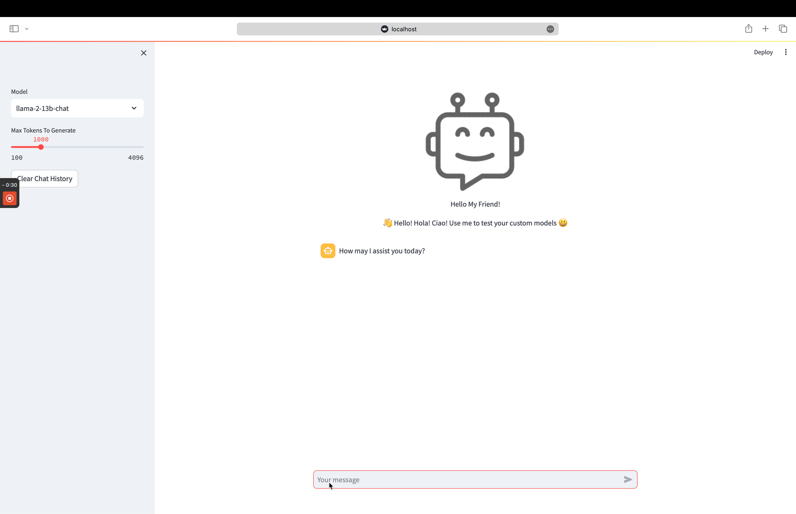

<a name="readme-top"></a>

<!-- PROJECT SHIELDS -->
<!--
-->
[![Contributors][contributors-shield]][contributors-url]
[![LinkedIn][linkedin-shield]][linkedin-url]


<!-- PROJECT INFO -->
<br />
<div align="center">
<h3 align="center">ChatMeUp</h3>

  <p align="center">
    A simple framework to create personal ChatBots
    <br />
    <a href="https://github.com/PerifanosPrometheus/chatmeup/tree/main/demo/Sample_Q&A.gif">View Demo</a>
  </p>
</div>


<!-- TABLE OF CONTENTS -->
<details>
  <summary>Table of Contents</summary>
  <ol>
    <li>
      <a href="#about-the-project">About The Project</a>
    </li>
    <li>
      <a href="#setup">Setup</a>
    </li>
  </ol>
</details>


<!-- ABOUT THE PROJECT -->
## About The Project

As I was working on the creation of personalized chat-bots via fine-tuning of llama models, I developed a simple package based on streamlit that streamlines the creation of simple Q&A chatbot applications.

This is effectively a plug .gguf file for your model(whether fine-tuned or downloaded) & have fun asking it questions :smile:

Currently, this is not developed to be used by other people other than myself but maybe in the future I will modify the project so that it can easily allow to do so and create documentation.


<!--  -->
## Setup

1. Download package from github.

1. Move to package directory just downloaded.

   ```cd path/to/chatmeup```

2. Create python environment. In this guide we use venv but you can use anaconda if you would like.

    ```python -m venv name_of_environment```

3. Activate python environment
    - For Mac:

      ```source name_of_environment/bin/activate```
    - For Windows:

      ```name_of_environment\Scripts\Activate.ps1```

4. Instal package requirements

    ```pip3 install -r requirements.txt```

5. Define path to chatmeup as an environment variable.

    ```export MODULE_PATH="/path/to/chatmeup"```

    You will be able to access this path in your python scripts using the following:

    ```
    import os
    # Access file paths from environment variables
    module_path = os.environ.get('MODULE_PATH')
    ```

6. Create a models folder and add your fine-tuned model .gguf file to it or download the .gguf file for the model you are trying to test into it.

7. Create a prompt template text file based on your model. You must utilize the placeholder {input} for the part of the prompt that you want to be replaced by the user input at inference. You must call the file with the name of the model. Here is an example:
    - For a model with gguf file called: llama-2-13b-chat.Q4_K_M.gguf. 
    - You should create a text file called: llama-2-13b-chat. 
    - The text file should contain the prompt template to be used at inference:
    ```
    [INST] <<SYS>>
    You are an helpful assistant. You answer questions cordially, and respectfully.
    <</SYS>>

    {input} [/INST]
    ```

8. Create a json file that will store configurations for the model. This file should follow the following naming convetion: name of the model-config.json. Here is an example:
    - For a model with gguf file called: llama-2-13b-chat.Q4_K_M.gguf. 
    - You should create a json file called: llama-2-13b-chat-config. 
    - The json file should contain configs about the model. At the bare minimum it should contain n_threads, n_ctx, n_gpu_layers, temperature, top_p, rope_freq_base, repeat_penalty, model_path, model_template:
    ```
    {
      "n_threads": 8, 
      "n_ctx":512,
      "n_gpu_layers":0,
      "temperature": 0.9,
      "top_p":0.9,
      "rope_freq_base": 10000,
      "repeat_penalty": 1.1,
      "model_path":"/Users/uvl6686/repos/chatmeup/models/llama-2-13b-chat.Q4_K_M.gguf",
      "model_template": "/Users/uvl6686/repos/chatmeup/prompt_templates/inference/llama-2-13b-chat.txt"
    }
    ```
9. Modify ChatBot.py to ensure the model you are trying to test can be selected. Here is an example:
    - For a model with gguf file called: llama-2-13b-chat.Q4_K_M.gguf. 
    - Make sure the following lines in ChatBot.py present the model you are trying to test as an option.
    ```
    # Add a selectbox to the sidebar:
    model_type=st.sidebar.selectbox(
                    'Model',
                    ('llama-2-13b-chat',)
                )
    ```
    - If you want to test multiple models you can perform the steps 6-8 above and then simply add an additional option. Here is an example when adding the codellama-7b model:
    ```
    # Add a selectbox to the sidebar:
    model_type=st.sidebar.selectbox(
                    'Model',
                    ('llama-2-13b-chat','codellama-7b')
                )
    ```

10. Change working directory to be chatmeup/src/main/streamlit:

    ```cd ./src/main/streamlit/```

11. Utilize the following comand to run the application locally:
    ```streamlit run ChatBot.py```

You should now be able to play around with your model. Here is an example of what it should look like:



<!-- CONTACT -->
## Contact

Giorgio Di Salvo - disalvogiorgio97@gmail.com

<p align="right">(<a href="#readme-top">back to top</a>)</p>


<!-- MARKDOWN LINKS & IMAGES -->
<!-- https://www.markdownguide.org/basic-syntax/#reference-style-links -->
[contributors-shield]: https://img.shields.io/github/contributors/PerifanosPrometheus/chatmeup.svg?style=for-the-badge
[contributors-url]: https://github.com/PerifanosPrometheus
[linkedin-shield]: https://img.shields.io/badge/-LinkedIn-black.svg?style=for-the-badge&logo=linkedin&colorB=555
[linkedin-url]: https://www.linkedin.com/in/giorgiodisalvo/